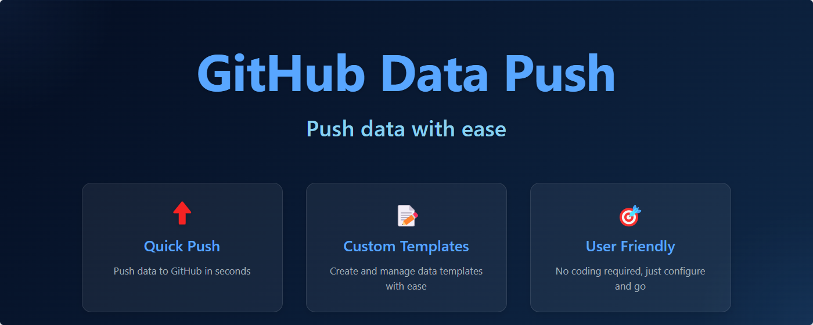

# GitHub Data Push

<p align="center">
  
</p>

<p align="center">
  <a href="README.md">English</a> | <a href="README.zh-CN.md">简体中文</a>
</p>

A browser extension that helps you push data to GitHub repositories using customizable templates.

## ✨ Features

- 🎨 **Custom Templates**: Create and manage data templates for different scenarios
- 🌍 **Multi-language Support**: Available in 7 languages
- 🔒 **Secure**: Token stored locally, secure GitHub API communication
- 📝 **Easy to Use**: Intuitive interface for data input and management
- 🔄 **Flexible**: Support various data types and formats

## 🌐 Browser Support

- Chrome/Edge (Manifest V3)
- Firefox (Manifest V2)

<p align="center">
  
</p>

## 📦 Installation

### Chrome/Edge
1. Download `chrome-github-data-push.zip` from the [latest release](../../releases/latest)
2. Unzip the file
3. Go to Chrome/Edge extensions page
4. Enable "Developer mode"
5. Click "Load unpacked" and select the unzipped folder

### Firefox
1. Download `firefox-github-data-push.xpi` from the [latest release](../../releases/latest)
2. Open Firefox
3. Go to `about:addons`
4. Click the gear icon and select "Install Add-on From File"
5. Select the downloaded .xpi file

## 🚀 Getting Started

1. Install the extension
2. Click the extension icon
3. Go to settings and add your GitHub token
4. Select or create a template
5. Choose a repository
6. Fill in the data and submit

## 🔑 GitHub Token

You need a GitHub token with `repo` scope to use this extension. To create one:

1. Go to [GitHub Settings > Developer settings > Personal access tokens](https://github.com/settings/tokens)
2. Click "Generate new token"
3. Select the `repo` scope
4. Generate and copy the token
5. Paste the token in the extension settings

## 🌍 Supported Languages

- English
- 简体中文 (Chinese Simplified)
- 日本語 (Japanese)
- 한국어 (Korean)
- Français (French)
- Deutsch (German)
- Español (Spanish)

## 📝 Template Format

Templates are defined in JSON format:

```json
{
  "name": "Template Name",
  "fieldOrder": ["field1", "field2"],
  "fields": {
    "field1": {
      "type": "text",
      "label": "Field Label",
      "required": true,
      "default": "Default Value"
    }
  },
  "filename": "data/output.json"
}
```

Supported field types:
- `text`: Single line text
- `textarea`: Multi-line text
- `select`: Dropdown selection
- `date`: Date picker
- `number`: Number input
- `checkbox`: Boolean checkbox
- `radio`: Radio button group

## 🤝 Contributing

Contributions are welcome! Please feel free to submit a Pull Request.

## 📄 License

This project is licensed under the MIT License - see the [LICENSE](LICENSE) file for details. 