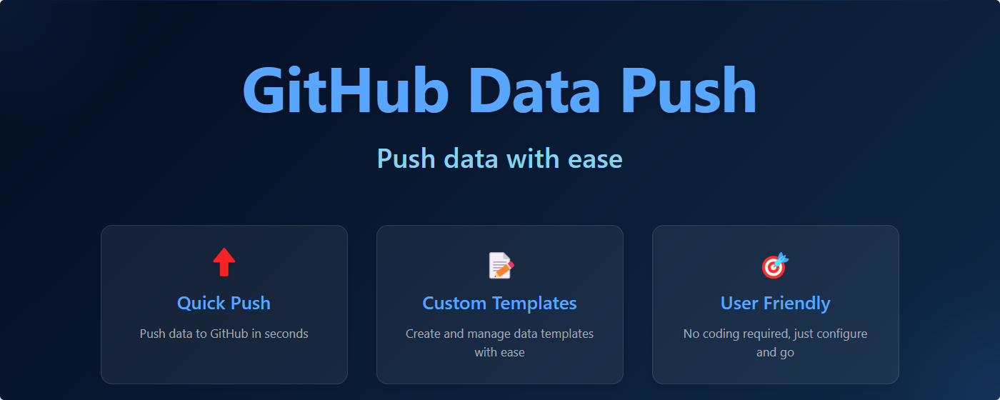

# GitHub Data Push

<p align="center">
  
</p>

<p align="center">
  <a href="README.md">English</a> | <a href="README.zh-CN.md">简体中文</a>
</p>

一个帮助你使用自定义模板推送数据到 GitHub 仓库的浏览器扩展。

## ✨ 特性

- 🎨 **自定义模板**：创建和管理不同场景的数据模板
- 🌍 **多语言支持**：支持 7 种语言
- 🔒 **安全可靠**：Token 本地存储，安全的 GitHub API 通信
- 📝 **易于使用**：直观的数据输入和管理界面
- 🔄 **灵活多样**：支持多种数据类型和格式

## 🌐 浏览器支持

- Chrome/Edge (Manifest V3)
- Firefox (Manifest V2)

<p align="center">
  
</p>

## 📦 安装方法

### Chrome/Edge
1. 从[最新发布](../../releases/latest)下载 `chrome-github-data-push.zip`
2. 解压文件
3. 打开 Chrome/Edge 扩展页面
4. 启用"开发者模式"
5. 点击"加载已解压的扩展程序"并选择解压后的文件夹

### Firefox
1. 从[最新发布](../../releases/latest)下载 `firefox-github-data-push.xpi`
2. 打开 Firefox
3. 访问 `about:addons`
4. 点击齿轮图标，选择"从文件安装附加组件"
5. 选择下载的 .xpi 文件

## 🚀 快速开始

1. 安装扩展
2. 点击扩展图标
3. 进入设置并添加 GitHub token
4. 选择或创建模板
5. 选择仓库
6. 填写数据并提交

## 🔑 GitHub Token

你需要一个具有 `repo` 权限的 GitHub token 来使用此扩展。创建步骤：

1. 访问 [GitHub 设置 > 开发者设置 > 个人访问令牌](https://github.com/settings/tokens)
2. 点击"生成新令牌"
3. 选择 `repo` 权限
4. 生成并复制令牌
5. 将令牌粘贴到扩展设置中

## 🌍 支持的语言

- 简体中文
- English (英语)
- 日本語 (日语)
- 한국어 (韩语)
- Français (法语)
- Deutsch (德语)
- Español (西班牙语)

## 📝 模板格式

模板使用 JSON 格式定义：

```json
{
  "name": "模板名称",
  "fieldOrder": ["field1", "field2"],
  "fields": {
    "field1": {
      "type": "text",
      "label": "字段标签",
      "required": true,
      "default": "默认值"
    }
  },
  "filename": "data/output.json"
}
```

支持的字段类型：
- `text`：单行文本
- `textarea`：多行文本
- `select`：下拉选择
- `date`：日期选择器
- `number`：数字输入
- `checkbox`：布尔复选框
- `radio`：单选按钮组

## 🤝 贡献

欢迎贡献！请随时提交 Pull Request。

## 📄 许可证

本项目采用 MIT 许可证 - 查看 [LICENSE](LICENSE) 文件了解详情。 